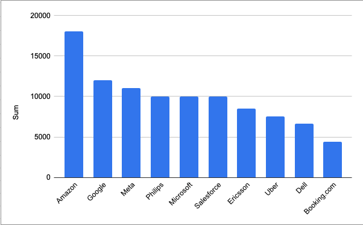
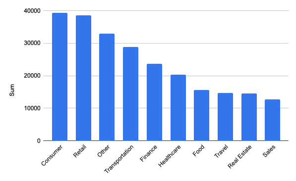
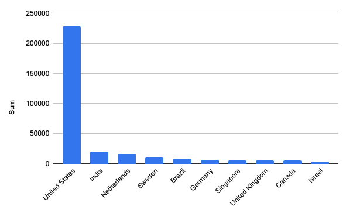
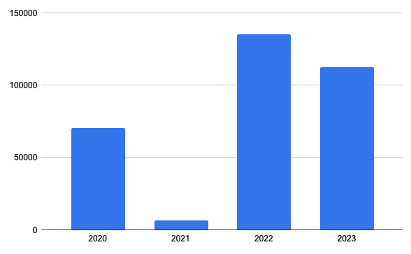
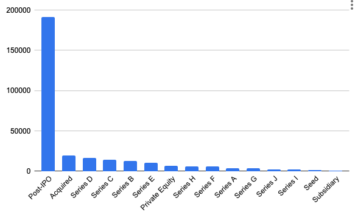
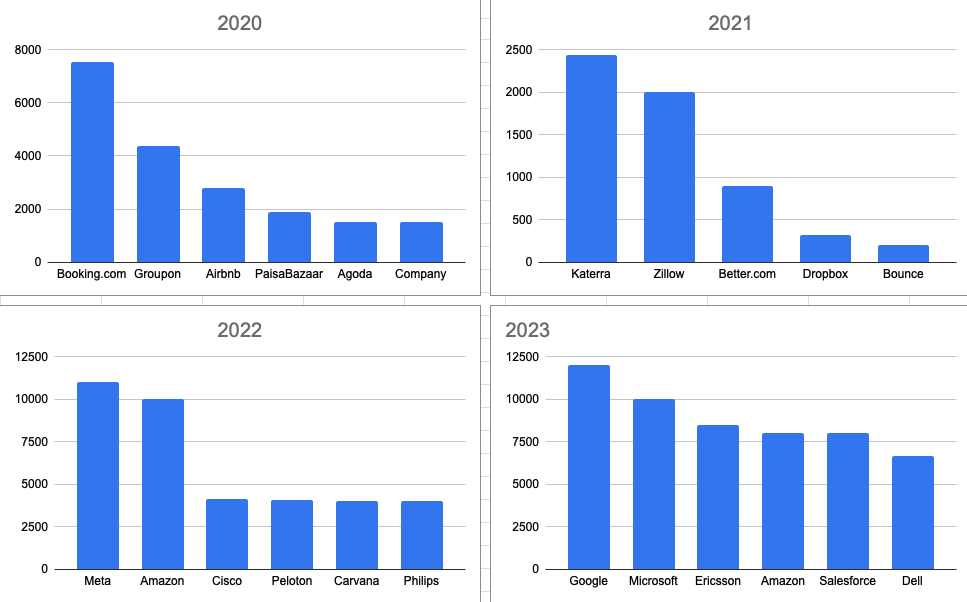
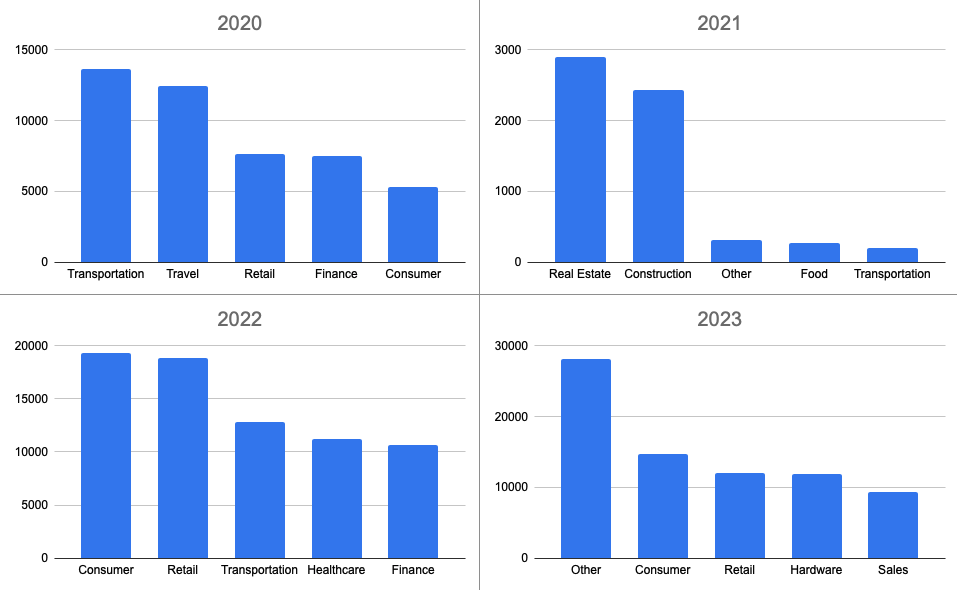

# Introduction
In this project I dived into layoff data. This project answers some questions like "What are the top 10 countries that have highest layoffs?" and "What are the top 10 companies that have highest layoffs?
"

This project's data sourse cames from Alex The Analyst Youtube channel and guided by tha same sourse.

# Tools I Used
For my deep dive into the layoofs data, I harnessed the power of several key tools:

- SQL: The backbone of my analysis, allowing me to query the database and unearth critical insights.
- PostgreSQL: The chosen database management system, ideal for handling the job posting data.
- Visual Studio Code: My go-to for database management and executing SQL queries.
- Git & GitHub: Essential for version control and sharing my SQL scripts and analysis, ensuring collaboration and project tracking.

# The Analysis 
Each query for this project aimed at investigating specific aspects of the data analyst jayoffs data. Here’s how I approached each question:

## Data Cleaning
To achieve a reliable analysis, I ensure data quality by removing duplicate entries, standardizing the data, and eliminating null values.

### Remove Duplicate Values
```sql
WITH duplicate_cte AS
(
    SELECT*,
    ROW_NUMBER() OVER(
        PARTITION BY company, location, industry, total_laid_off, 
        percentage_laid_off, 'date', stage, country, funds_raised_millions) AS row_num
    FROM layoffs_data
)
SELECT*
FROM duplicate_cte
WHERE row_num > 1;

-- Created new table with new column, row_num.
CREATE TABLE layoffs_staging(
    company TEXT,
    location TEXT,
    industry TEXT,
    total_laid_off NUMERIC,
    percentage_laid_off NUMERIC,
    date DATE,
    stage TEXT,
    country TEXT,
    funds_raised_millions NUMERIC,
    row_num INT
);
-- Inserted all data to new table.
INSERT INTO layoffs_staging
SELECT*,
ROW_NUMBER() OVER(
        PARTITION BY company, location, industry, total_laid_off, 
        percentage_laid_off, 'date', stage, country, funds_raised_millions) AS row_num
    FROM layoffs_data

-- Deleted all duplicated values 
DELETE
FROM layoffs_staging
WHERE row_num > 1;

-- Removed the row_num column
ALTER TABLE layoffs_staging
DROP COLUMN row_num;

--We have 2340 unique values
SELECT*
FROM layoffs_staging
```

### Standardize Values  
```sql
-- Wiith TRIM we cleaned the spaces insides some columns.

 UPDATE layoffs_staging
 SET company = TRIM(company);

 -- Checked unique values in industry and found same ones but different names. Corrected(3 values), like Crypto and CryptoCurrency .
SELECT DISTINCT industry
FROM layoffs_staging
ORDER BY 1;

 UPDATE layoffs_staging
 SET industry = 'Crypto'
 WHERE industry LIKE 'Crypto%';

 -- Same proces for country. Found one problem United States
UPDATE layoffs_staging
SET country = 'United States'
WHERE country LIKE 'United States%';

SELECT DISTINCT country
FROM layoffs_staging
ORDER BY 1;
```
### Remove NULL and Blank Values Which are Related Layoffs Numbers
```sql
-- Check for blank or null values for indusrty.(4 null or blank values)
SELECT *
FROM layoffs_staging
WHERE industry IS NULL OR
    industry = '';

--Check for are there any other values that we can reach industry information
SELECT t1.company, t1.industry, t2.industry
FROM layoffs_staging AS t1
JOIN layoffs_staging AS t2 ON
    t1.company = t2.company
WHERE (t1.industry IS NULL OR t1.industry = '') AND
    t2.industry IS NOT NULL

-- Correct null values
UPDATE layoffs_staging
SET industry = NULL
WHERE industry = '';

UPDATE layoffs_staging AS t1
SET industry = t2.industry
FROM layoffs_staging AS t2
WHERE t1.company = t2.company
  AND t1.industry IS NULL
  AND t2.industry IS NOT NULL;

-- Delete null values which are numeric. 1147 row deleted. We have 1193 unique and non null values.
DELETE 
FROM layoffs_staging
WHERE total_laid_off IS NULL
OR percentage_laid_off IS NULL;

SELECT *
FROM layoffs_staging
```
| Company         | Location      | Industry | Total Laid Off | Percentage Laid Off | Date       | Stage      | Country       | Funds Raised (Millions) |
|-----------------|---------------|----------|----------------|---------------------|------------|------------|---------------|-------------------------|
| Juul            | SF Bay Area    | Consumer | 400            | 0.3                 | 2022-11-10 | Unknown    | United States | 1500                    |
| Quidax          | Lagos          | Crypto   | 20             | 0.2                 | 2022-11-24 | Unknown    | Nigeria       | 3                       |
| Shakepay        | Montreal       | Crypto   | 21             | 0.25                | 2023-01-27 | Series A   | Canada        | 45                      |
| Swyftx          | Brisbane       | Crypto   | 74             | 0.21                | 2022-08-17 | Unknown    | Australia     | NULL                    |
| Swyftx          | Brisbane       | Crypto   | 90             | 0.4                 | 2022-12-05 | Unknown    | Australia     | NULL                    |
| WazirX          | Mumbai         | Crypto   | 60             | 0.4                 | 2022-10-02 | Acquired   | India         | NULL                    |
| Protocol Labs   | SF Bay Area    | Crypto   | 89             | 0.2                 | 2023-02-03 | Unknown    | United States | 10                      |
| TIFIN           | Boulder        | Crypto   | 24             | 0.1                 | 2022-06-14 | Series D   | United States | 204                     |
| Banxa           | Melbourne      | Crypto   | 70             | 0.3                 | 2022-06-27 | Post-IPO   | Australia     | 13                      |
| BitMEX          | Non-U.S.       | Crypto   | 75             | 0.25                | 2022-04-04 | Seed       | Seychelles    | 0                       |

## Exploratory Data Analysis

```sql
-- What are the top 10 companies that have highest layoffs.
SELECT company, SUM(total_laid_off)
FROM layoffs_staging
WHERE total_laid_off IS NOT NULL
GROUP BY company
ORDER BY 2 DESC
LIMIT 10;
```


```sql
-- What is the date range of this table. It is 2020 and 2023.
SELECT MIN(date), MAX(date)
FROM layoffs_staging;
```
The data we have covers the years 2020 and 2023
```sql
-- What are the top 10 industries that have highest layoffs.
SELECT industry, SUM(total_laid_off)
FROM layoffs_staging
GROUP BY industry
ORDER BY 2 DESC
LIMIT 10;
```

```sql
-- What are the top 10 countries that have highest layoffs.
SELECT country, SUM(total_laid_off)
FROM layoffs_staging
GROUP BY country
ORDER BY 2 DESC
LIMIT 10;
```


```sql
-- What are the total layoff numbers based on year?
SELECT EXTRACT(YEAR FROM date) AS year, SUM(total_laid_off) AS total_laid_off
FROM layoffs_staging
WHERE date IS NOT NULL
GROUP BY year
ORDER BY year DESC;
```

```sql
-- What stages have the most layoffs?
SELECT stage, SUm(total_laid_off)
FROM layoffs_staging
GROUP BY stage
ORDER BY 2 DESC;
```
- **Series A, B, C, D:** Different stages of company funding to support growth and expansion.
- **Post-IPO:** The phase after a company goes public and its shares are traded on the stock market.
- **Acquired:** The company has been bought by another company, often becoming a part of it.


```sql
-- What is th total number of layoff?
WITH rolling_total AS
(
    SELECT TO_CHAR(date, 'YYYY-MM') AS month, SUM(total_laid_off) AS total_off
    FROM layoffs_staging
    WHERE date IS NOT NULL
    GROUP BY month
    ORDER BY month ASC
)
SELECT month, total_off, SUM(total_off) OVER(ORDER BY month) AS rolling_total
FROM rolling_total;
```
The number of total layoffs is  324.892
```sql
-- What are the top 5 companies that have highest layoffs each year
WITH company_year(company,years,total_laid_off) AS
(
    SELECT company, EXTRACT(YEAR FROM date) AS year, SUM(total_laid_off) AS total_off
    FROM layoffs_staging
    GROUP BY company, year
    ORDER BY 3 DESC
), company_year_rank AS
(
SELECT *, DENSE_RANK() OVER (PARTITION BY years ORDER BY total_laid_off DESC) AS ranking
FROM company_year
WHERE years IS NOT NULL
)

SELECT *
FROM company_year_rank
WHERE ranking <= 5
```

```sql
-- What are the top 5 industries that have highest layoffs each year
WITH company_year(industry,years,total_laid_off) AS
(
    SELECT industry, EXTRACT(YEAR FROM date) AS year, SUM(total_laid_off) AS total_off
    FROM layoffs_staging
    GROUP BY industry, year
    ORDER BY 3 DESC
), company_year_rank AS
(
SELECT *, DENSE_RANK() OVER (PARTITION BY years ORDER BY total_laid_off DESC) AS ranking
FROM company_year
WHERE years IS NOT NULL
)

SELECT *
FROM company_year_rank
WHERE ranking <= 5
```


# Conclusion
### Insights
From the analysis, some general insights came out:

1. Companies like Amazon, Google, Meta (Post-IPO) have the highest layoff numbers.
2. Consumer and retail industries have the highest layoffs.
3. United States have highest number of layoffs between 2020-2023.
4. 2022 and 2023 are the critical years for high layoffs.
5. There are no correlation between series A-J funding and layoffs. On the other hand Post-IPO companies have the highest layoffs which might be the size of them.
6. Every year top 5 layoffs companies and industries are different it is not possible to find correlation or causation between them.

### Closing Thoughts
This project provide me hands on experience on SQL also gave me insights about global layoffs data. It is clear that large companies are making excessive layoffs.
